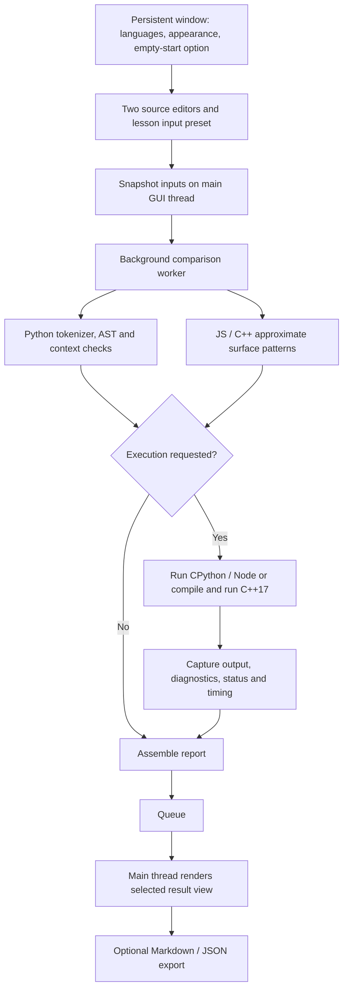

# PPL Semantics Analyzer — Project Documentation

**University:** Mapua University\
**Application name:** Paradigm Diagnostics\
**Status:** Presented and graded\
**Course:** CSS125P — Principles of Programming Languages\
**Group:** 4\
**Assignment:** Programming Language Comparison and Demonstration System\
**Authors:** Joseph Gabriel A. Roces, Marc Jansen D. Felipe, Nikolai P. Lagarde, and Danaiah Niccola D. Bajao\
**Documentation updated:** 2026-09-30

## 1. Project Title and Introduction

**PPL Semantics Analyzer: An Interactive Programming Language Comparison and Demonstration System**

This desktop application lets students compare small Python, JavaScript, and C++ programs side by side. Students can inspect source structure, execute both snippets with the selected lesson’s input preset, and explain differences using programming-language concepts. It is designed for Group 4's comparison assignment. The application is branded **Paradigm Diagnostics** in the interface and retains **PPL Semantics Analyzer** as its repository/project title. The project has been presented and graded at Mapua University.

The system uses real host toolchains for execution. Python receives native tokenization and AST inspection. JavaScript and C++ receive approximate source-pattern analysis, explicitly labeled in the interface. This difference is itself useful for discussing the boundary between lexical pattern matching and grammatical parsing.

## 2. Problem Statement

Students can memorize definitions of syntax, scope, typing, and parameter passing without seeing how those concepts affect a running program. Similar-looking expressions may behave differently across languages. For example, combining string text and a number can produce a value, a runtime error, or a compilation error.

A comparison tool needs to expose both the program's structure and its observed behavior. It must also remain usable when a demonstration contains invalid syntax, throws an exception, or never finishes within a reasonable time.

The project addresses this need with editable examples, visible analysis evidence, actual toolchain diagnostics, finite input, and controlled local execution.

## 3. General and Specific Objectives

### General objective

Provide a functional desktop system that demonstrates and compares core PPL concepts through inspectable, executable examples in three languages.

### Specific objectives

1. Accept two independently editable snippets and selected languages.
2. Explain at least five PPL concepts using deterministic demonstrations.
3. Show Python tokens, parsed structure, and structural metrics without execution.
4. Clearly distinguish approximate JavaScript/C++ structure from actual parser/compiler diagnostics.
5. Supply finite lesson input presets and display stdout, stderr, exit status, and timing.
6. Handle source errors, missing tools, runtime failures, cancellation, output floods, and timeouts.
7. Export reproducible source/input/result snapshots.
8. Verify both successful and erroneous inputs with automated tests and native GUI checks.

## 4. Programming Language Concepts Applied

| Concept | Concrete demonstration | What students can explain |
| :--- | :--- | :--- |
| Paradigms | Iterative accumulator and recursive factorial | Imperative state updates versus function-based decomposition; these languages support multiple styles |
| Lexical analysis | Python token preview | Names, keywords, operators, literals, and indentation become tokens |
| Syntax and grammar | Valid factorial versus Syntax error lesson | A grammar determines which token sequences form valid programs |
| Semantics | Types and coercion lesson | The same-looking `+` operation has different effects depending on language and operand types |
| Data types and type checking | String/integer combination | Runtime type rejection in Python, coercion in JS, compile-time rejection for the selected C++ operation |
| Variables and binding | Iteration | Assignment binds/updates names; repeated assignment is not a new unique spelling |
| Scope and shadowing | Lexical scope lesson | A local `value` and global `value` are separate bindings |
| Selection and iteration | Factorial base case; accumulator loop | Conditions choose a path; loops repeat state updates |
| Functions and recursion | factorial(5) | Parameters receive arguments; the base case terminates direct recursive descent |
| Parameter passing | Shared containers versus a C++ reference parameter | Mutation of shared data differs from local parameter rebinding |
| Error handling | Input and validation; Runtime error | Handled failures produce a useful message; uncaught failures terminate the child process |

Python name binding and parameter behavior are explained by its [execution model](https://docs.python.org/3/reference/executionmodel.html) and [function tutorial](https://docs.python.org/3/tutorial/controlflow.html#defining-functions). JavaScript addition is specified in the [ECMAScript expression rules](https://tc39.es/ecma262/multipage/ecmascript-language-expressions.html#sec-addition-operator-plus). C++ reference parameters are described in the [C++ draft reference declarations](https://eel.is/c++draft/dcl.ref). The implementation demonstrates a small subset of these languages.

## 5. Language / Program Design

### Inputs

- Source A and B, each with a selected language: Python, JavaScript, or C++.
- Shared standard input from the loaded lesson, delivered independently as finite text to each process. The current UI has no editable stdin panel; the backend API accepts arbitrary input text. The input-validation lesson supplies `7` and produces `49`; invalid inputs are covered by backend tests.
- An execution timeout selected from 1, 2, 5, or 10 seconds in the UI.
- A lesson selection or UTF-8 source file.

The public runner accepts a positive finite timeout up to 30 seconds. The dashboard limits each source to 100,000 characters. It is intended for small examples, not large projects.

### Processing modes

**Analyze only:** inspect source without executing it. Python is tokenized, parsed, and compiled to a code object for context checks; that code object is never evaluated. JavaScript/C++ receive only approximate structural analysis.

**Run comparison:** perform analysis, then run both snippets sequentially in a background worker. Python with a detected syntax error is skipped. JavaScript is handed to Node; C++ is compiled with C++17 and executed only if compilation succeeds.

### Outputs

- **Static AST:** analysis method, syntax-validation status, counts, name lists, recursion candidates, limitations, tokens, and tree/pattern evidence.
- **Runtime:** success/failure status, stdout, diagnostics, exit code, execution time, and separate compilation time.
- **PPL Verdict:** language reference facts, observed structural evidence, and a conditional stdout comparison.
- **Export:** Markdown for reading or JSON for machine processing; both contain the original source/input snapshot.

### Design decisions

The UI adapts the team's Java Car Rental design into a split launcher and a collapsible dashboard with persistent content pages. Shared design tokens control both themes, terminal-green accents, and rounded components. The three dashboard pages are Workspace, Demonstrations, and Reports. Both editors have line-number gutters and Pygments syntax coloring; lexical coloring does not validate syntax. Analysis and execution remain independent of CustomTkinter. A queue connects the worker to the main Tk thread so a slow child does not freeze the desktop window.

## 6. Keywords, Identifiers, Operators, Literals, Data Types, Statements, and Expressions

| Category | Python example | JavaScript example | C++ example |
| :--- | :--- | :--- | :--- |
| Keywords | `def`, `if`, `return`, `for`, `try` | `function`, `if`, `return`, `let`, `try` | `int`, `if`, `return`, `for`, `try` |
| Identifiers | `factorial`, `n`, `total` | `factorial`, `n`, `total` | `factorial`, `n`, `total` |
| Operators | `+`, `*`, `<=`, `=` | `+`, `*`, `<=`, `=`, `++` | `+`, `*`, `<=`, `=`, `++` |
| Literals | `5`, `"5"`, `True` | `5`, `"5"`, `true` | `5`, `"5"`, `true` |
| Types in lessons | integer, string, list | Number, String, Array object | `int`, `std::string`, reference to `int` |
| Statements | assignment, `if`, `for`, `return` | declaration, `if`, `for`, `return` | declaration, `if`, `for`, `return` |
| Expressions | `n * factorial(n - 1)` | `n * factorial(n - 1)` | `n * factorial(n - 1)` |

An expression computes a value; a statement performs a language-defined action or controls execution. A function call can be part of an expression, such as the recursive call multiplied by `n`. Python built-ins such as `print` are names, not keywords.

## 7. Grammar / Syntax Rules

The system accepts the existing syntax of the selected host language. It does not invent or claim to parse a new language. The following EBNF is an **illustrative subset for explaining the factorial demonstration**, not the implemented or complete grammar.

```text
factorial_function ::= "def" identifier "(" identifier ")" ":"
                       NEWLINE INDENT base_case recursive_return DEDENT
base_case          ::= "if" identifier "<=" integer ":"
                       NEWLINE INDENT "return" integer NEWLINE DEDENT
recursive_return   ::= "return" identifier "*" identifier
                       "(" identifier "-" integer ")" NEWLINE
identifier         ::= letter { letter | digit | "_" }
integer            ::= digit { digit }
```

`::=` means “is defined as”; braces mean repetition. NEWLINE, INDENT, and DEDENT represent line and indentation structure. The header requires a function name, parentheses, a parameter name, and a colon. The two body rules represent the conditional base case and recursive return. This intentionally simplified identifier rule omits Unicode and other details of actual Python.

```python
def factorial(n):
    if n <= 1:
        return 1
    return n * factorial(n - 1)
```

`def` introduces the function; `factorial` names it; `n` is a formal parameter. The colon starts its indented body. If `n` is at most one, execution returns one immediately. Otherwise, it evaluates the recursive call with `n - 1`, multiplies the returned value by `n`, and returns that product. The selected demonstration calls it with five; the mathematical recurrence alone does not make it safe for every possible input or arbitrary recursion depth.

JavaScript expresses the corresponding function with `function`, parentheses, braces, and semicolon-terminated returns. C++ adds explicit `int` types and a `main` entry function. Their real grammar validation is delegated to Node and the C++ compiler on Run. Python's [AST API](https://docs.python.org/3/library/ast.html) provides parsed nodes; the [tokenizer API](https://docs.python.org/3/library/tokenize.html) provides lexical evidence.

## 8. Program Architecture / Flow



The arrows show data flow. Only the source snapshot enters the worker; it never reads widget state. The queue transfers ordinary Python dictionaries back to the UI. `after()` polls for completion while Tk continues processing user events. Stop sets a thread-safe event that the runner checks during process polling.

This adapts the professor's suggested pipeline: **Source → lexical/structural analysis → syntax/context/type diagnostics where supported → actual execution → comparative output**. There is no independent complete semantic-analysis pass for all three languages. The real compiler/runtime supplies many semantic checks, and the interface explains their results.

## 9. Implementation Details

| Module | Responsibility and main logic |
| :--- | :--- |
| `main.py` / `ui/application.py` | Own one native window and event loop; swap entry/workspace child pages while preserving geometry |
| `core/ast_analyzer.py` | Fresh result dictionaries; Python tokenizer/AST walk; explicit pattern limitations for JS/C++ |
| `core/execution_runner.py` | Validate request; create temporary directory; choose tool; compile C++ if needed; poll child; collect bounded text |
| `core/examples.py` | Lesson text, source variants, default stdin, expected outputs/statuses used by tests |
| `core/comparison.py` | Orchestrate two analyses/runs; compare only successful stdout; render three views and Markdown |
| `core/self_check.py` | Run real factorial programs to verify that located tools work |
| `ui/main_window.py` | Build panels; snapshot input; start worker; render reports; invalidate stale results; open/export files |
| `ui/launcher_window.py` | Pass language and appearance values to the persistent application root |
| `ui/ui_assets.py` | Central color, typography, syntax colors, card radii, and widget helpers |
| `ui/line_numbers.py` | Canvas gutters aligned to native Tk text geometry and scroll callbacks |
| `ui/syntax_highlighting.py` | Pygments lexical tags, 120 ms debounce, Unicode indexing, and cleanup |
| `ui/lesson_resources.py` | Nine card summaries and filenames for bundled lesson PDFs |

### Workspace lifecycle and lesson resources

`Application` owns one native root and event loop. Entry and workspace are child frames; opening the workspace preserves window geometry. **Start with empty editors** bypasses the initial recursion lesson. Navigation among Workspace, Demonstrations, and Reports retains source and report state.

**Clear results** removes diagnostics and disables export while retaining source/settings. **Clear workspace** also empties both editors and preset input, retaining languages and appearance. Both actions are disabled during comparisons. **Back to Menu** cancels work, removes polling, keyboard, and highlighting callbacks, and destroys the workspace before showing a fresh launcher. It retains appearance but does not save unsaved code or reports.

Demonstration cards load matching language examples or open a bundled PDF. PDF paths are relative to the repository; missing files or failed opening produce a recoverable dialog. Source, language, or timeout changes invalidate the previous report.

### Analysis definitions

- Functions: named Python functions plus lambdas; supported named brace-bodied patterns for JS/C++.
- Variables: unique Python names stored or used as parameters/imports/exception targets; simple declaration names for JS/C++. This is not a complete symbol table and does not count separate same-spelling bindings in different scopes.
- Loops: Python `for`, `async for`, `while`, and comprehension generators; surface `for`/`while` patterns for JS/C++.
- Scope depth: structural nesting of Python functions, classes, lambdas, and comprehensions. It is not a complete model of name resolution, class lookup, annotation scopes, or comprehension evaluation. Unknown for the other languages.
- Recursion: direct same-name call candidates in the function body. Python separately nested definitions are excluded. Name rebinding, aliases, methods, mutual recursion, and complex surface-language scope are not resolved.
- Tokens: Python non-comment/non-line-separator tokens, including indentation evidence. Surface counts exclude masked literals/comments, so raw counts are not directly comparable across methods.

### Execution and error states

| Status | Meaning |
| :--- | :--- |
| `success` | Process exited with zero status |
| `syntax_error` | Python static validation rejected source; comparison did not execute it |
| `runtime_error` | Launched interpreter/program exited unsuccessfully; Node syntax errors also arrive in this category with exact stderr |
| `compile_error` | C++ compiler rejected the source |
| `setup_error` | Missing tool, launch failure, or temporary-file failure |
| `input_error` | Empty source passed directly to the runner |
| `timeout` | Execution exceeded its wall-clock budget |
| `output_limit` | Captured output exceeded the monitored size threshold |
| `cancelled` | Stop/close requested cancellation |
| `compile_timeout`, `compile_cancelled`, etc. | Corresponding limit/failure during C++ compilation |

Each request uses a temporary source and working directory. Standard input comes from a finite file so reading past it returns EOF. Output is redirected to temporary files, avoiding pipe deadlocks and unbounded in-memory buffers. Every 10 ms the runner checks cancellation, output size, process exit, and timeout. UTF-8 decoding uses replacement for invalid bytes so arbitrary output does not crash the UI.

On macOS/POSIX the process starts in a new session; cleanup kills its process group and waits for the direct child. This handles ordinary descendant processes in that group. It is not isolation from hostile code, a memory limit, a filesystem/network restriction, or a guarantee against deliberately detached processes.

The full function-by-function reasoning and example traces are in [Code Walkthrough](code_walkthrough.md).

## 10. Testing and Results

### Recorded environment

On 2026-09-28, the presentation Mac used macOS 26.3 (Apple Silicon), Python 3.14.7, CustomTkinter 5.2.2, pytest 8.3.2, Node.js 26.9.0, and Apple clang 21.0.0 via `/usr/bin/g++`.

### Reproduction commands

```bash
venv/bin/python -m pytest -q
venv/bin/python -m core.self_check
venv/bin/python -m tests.gui_smoke
venv/bin/python -m tests.gutter_smoke
venv/bin/python -m tests.finalization_smoke
venv/bin/python -m tests.syntax_smoke
```

The first command runs the automated source/runner/comparison tests. The second actually executes all three toolchains. The remaining commands are opt-in native desktop checks: integration, gutter compatibility, final UI lifecycle, and syntax highlighting respectively. They open windows. On Windows, replace `venv/bin/python` with `.\venv\Scripts\python.exe`. GUI windows are excluded from ordinary pytest collection. Missing Node/C++ tools cause explicit test skips, which must not be mistaken for verified coverage on another machine.

### Meaningful normal and error cases

| Case | Input | Expected result | Recorded result |
| :--- | :--- | :--- | :--- |
| Recursive factorial | All three lesson variants, argument 5 | `120` | Passed |
| Iterative sum | Integers 1 through 5 | `15` | Passed |
| Local shadowing | Global 10, local 20 | `20` then `10` | Passed |
| Types and coercion | String text plus integer 2 | Python runtime error; JS `52`; C++ compile error | Passed |
| Parameter passing | Shared-container mutation / C++ reference assignment | Python and JS `1,2`; C++ `99` | Passed |
| Valid stdin | `7` | `49` | Passed |
| Invalid stdin | `abc`, `3.5`, `11`, empty | Handled input-error message | Passed in all languages |
| Malformed header | Syntax error lesson | Parser/compiler diagnostic | Passed |
| Uncaught error | Runtime error lesson | Nonzero exit and diagnostic | Passed |
| Infinite loop | Timeout lesson | Timeout with UI recovery | Passed |
| Output before timeout | Printed stdout/stderr followed by infinite loop | Decoded partial output retained | Passed |
| Ordinary helper call | Define helper; invoke outside its body | Not labeled recursive | Passed |
| Output flood | Infinite printing | Bounded captured text and stopped process | Passed |
| Stop | Event set during an infinite loop | Cancellation before full timeout | Passed |
| Missing Node | Simulated absent executable | Setup diagnostic | Passed |
| Static-only side effect | Source that would create a file | File never created | Passed |
| Report export | Successful comparison | Original source/input and all views serialized | Passed |

The 2026-09-30 automated run recorded **74 passed, zero skipped**, including all 27 lesson/language combinations. All three runtime self-checks also passed. These are historical verification results; this documentation-only update does not rerun application tests. The native GUI smoke check passed launcher handoff, language/theme preservation, execution, view rendering, file loading, JSON export, error display, cancellation, and recovery. On 2026-09-29 the native check also passed independent editor line numbering, 1,000-line source loading, insertion/deletion, vertical and horizontal scrolling, resizing, and light/dark gutter colors.

On 2026-09-30, the finalization smoke script passed layout, lesson input presets, clearing, empty startup, PDF action routing, menu round trips, and worker cancellation. The syntax smoke script passed both editors across all three languages, Unicode, typing, undo, selection, theme, and callback cleanup. PDF opening calls are mocked in the finalization script: this checks paths and action/error routing, not external viewer rendering or lesson content.

Desktop screenshot inspection was unavailable. Native widget/callback checks establish functional evidence, not visual review. The recorded native runs were on this Mac; Windows compatibility checks do not establish a full native Windows test run. Passing tests cover the checked cases, not every possible program or measured learning outcomes.

## 11. Conclusion and Recommendations

The application provides input, processing, output, and recoverable errors while demonstrating more than five PPL concepts. Its strongest teaching use is to connect source structure with actual behavior: show a language rule, run a small example, inspect the evidence, and explain the limits of that observation.

The project has completed its presentation and grading. The recorded tests support the implemented comparison workflows and error handling. Educational effectiveness has not been measured through a student study.

Future work should replace JavaScript/C++ surface patterns with dedicated parsers, introduce scoped symbol tables and richer type evidence, add saved workspaces and an editable stdin workflow, evaluate the lesson materials with students, add repeatable benchmark methodology, and isolate execution more strongly before accepting untrusted code.
